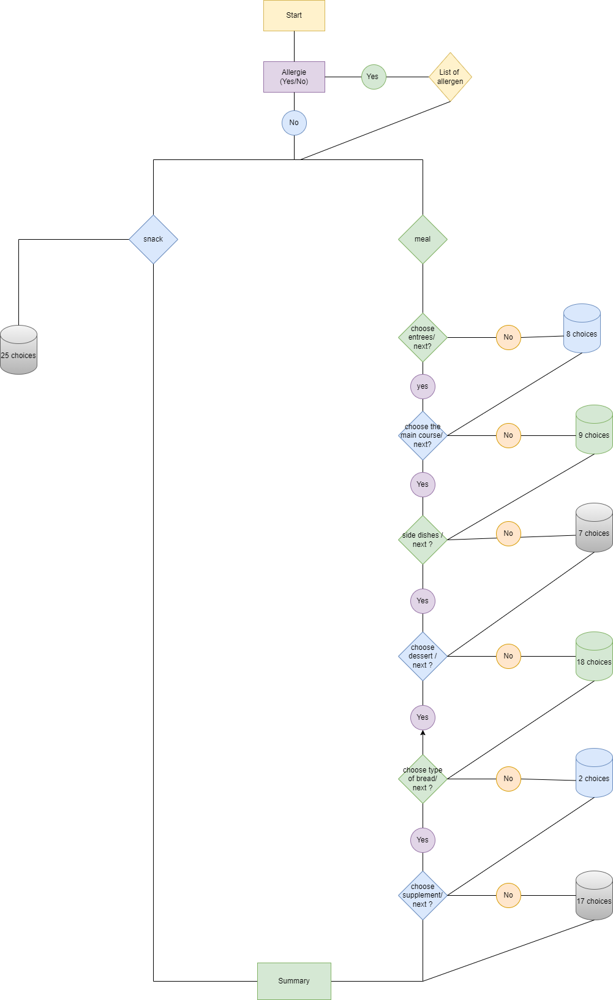
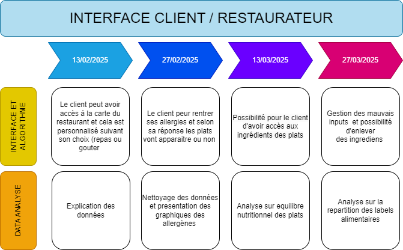

# 🍽️ Restaurant Menu & Allergen Information System  
## Table of contents 

1. [First steps](#firststep)
2. [Project Overview](#state)
3. [Key Features](#use of datasets)  
    
4. [Technologies Used](#tests)
5. [Project Structure](#)
6. [Next Steps](#outils)
7. [Source](#source)
8. [Authors](#auteurs)
9. [License](#licence)


## First steps <a name="firststep"></a>

1. Install the required dependencies, two methods are available:  

    - First method, use the command prompt, go to the root of the project (where the `requirements.txt` file is located) and executing the following command:  

    ```bash
    pip install -r requirements.txt 
    ```

  


## 📌 Project Overview  
This project aims to provide a user-friendly interface for restaurant customers to view dish compositions, including allergenic and non-allergenic ingredients. Our client, a restaurateur, wants to enhance transparency and improve customer experience by allowing them to check meal components before ordering.  

## 🔥 Key Features  
- 📝 **Menu Display**: Customers can browse the restaurant’s menu with detailed dish compositions.  
- ⚠️ **Allergen Information**: Clearly labeled allergens for each dish to help customers make informed choices.  
- 🔍 **Ingredient Breakdown**: A structured view of all ingredients, classified based on allergenic properties.  
- 📊 **Data Analysis & Visualization**: Statistical insights on dish frequency and allergen distribution using Python and Seaborn.  

## 🛠️ Technologies Used  
- **Python**: Data processing and analysis  
- **Pandas & NumPy**: Data cleaning and manipulation  
- **Seaborn & Matplotlib**: Data visualization  
- **VS Code**: Development environment  
- **GitHub** for version control

##  Getting Started
1. Clone the repository:
   ```bash
   git clone https://gitlab-mi.univ-reims.fr/mado0007/management_projet_digitaux.git
   cd management_projet_digitaux


## 📁 Project Structure  

The project is organized as follows: 

 ### 📂 data 
- Stores datasets in different states of processing.  
- Subdirectories:  
  ####- processed → Contains cleaned and transformed datasets ready for analysis and visualization.
                  -  dishes.xlsx → dishes cleaned datasets 
                  -  dishesancien.xlsx → the first cleaned datasets from dishes
                  -  menu.xlsx → cleaned datasets from menu 
  ####- raw → Contains the original datasets received from the client or external sources. 
                  -  dishes.xlsx → dishes datasets 
                  -  menu.xlsx →  datasets from menu

### 📂 docs
This folder contains all the essential documents related to the project. It includes diagrams, reports, design files, and other resources necessary for understanding and managing the project.
    #### Contents

        📌 Diagrams and Schematics:

            🖥️ Draw.io files – System architecture and workflow visualizations.

        🎨 Design and Planning:

            🖼️ Canva files – Graphical resources for UI/UX design.

        📄 Reports and Documentation:

            📖 Detailed reports – Project-related research, specifications, and notes.

        🖼️ Images:

        📷 PNG files – Illustrations, UI mockups, and documentation visuals.
Make sure to keep this folder organized, as it serves as a reference point for project development and documentation.


### 📂 src 
This folder contains the entire program, including all necessary scripts, data files, and configurations. It serves as the central repository for the project's development and execution.
Inside, you will find source code, dependencies, and resources essential for the application's functionality. Ensure all required files are present before running the program.

  #### - graph
      ##### - gitkeep 
      ##### - interface 

  #### - interface
      ##### - gitkeep 
      ##### - allergies.py 
      ##### - menu.py 
      ##### - nutrients.py 
      ##### - recap.py
      ##### - shared_data.py 
      ##### - validation.py 
      ##### - visualization.py

  #### - stat
      ##### - gitkeep
      ##### - cleaning_processing.py 
      ##### - modifdata.py
  #### - _init_.py 
  #### - main.py 
  
  

  ### test
  - Contains unit tests for validating different components of the project.  
- Ensures that the algorithms and functions  work correctly.  
- Uses `pytest` or `unittest` for automated testing.  

      #### - pytest.ini
      #### - test_allergies.py
      #### - test_main.py
      #### - test_menu.py
      #### - test_recap.py
      #### - test_validation.py
      #### - test_visualization.py


### gitignore
      #### 📂 **__pycache__/**  
              - Automatically generated by Python to store compiled versions of imported modules.  
              - Can be ignored and is usually not included in version control (`.gitignore`).  
      #### 📂 **.idea/**  
              - Contains project-specific settings and configurations for PyCharm.  
              - Can be ignored if using another IDE.  

  

### 📄 **README.md**  
- The main documentation file providing an overview of the project, setup instructions, and usage guidelines.  

##  Next Steps  
- Implement an interactive User interface for customer use  
- Optimize allergen labeling for better readability  
- Enhance visualization for improved data interpretation 

## Source 📚

The dataset describes the composition of the menus offered by the City of Antibes. It details the composition of the menus by listing the different dishes that make them up and indicates the descriptive elements relating to the origin of the dishes.  
You can access the database via the link : https://www.data.gouv.fr/fr/datasets/menus-de-la-restauration-collective-de-la-ville-dantibes/


## Authors <a name="auteurs"></a>

This project was developed by 4 students from the “Statistique pour l'Evaluation et la Prévision” (SEP) master's program at the University of Reims Champagne-Ardenne (class of 2024-2025). 

The contributors to this project and their roles are identified below : 

- Ismael Madou Gagi : Interface et Algorithmique 
- Mathéo Henault : Interface et Algorithmique
- Dimitri Delpech : Data Analyse 
- Perle Marie Salma Ndayizeye : Data Analyse 


## License <a name="licence"></a>

<p xmlns:cc="http://creativecommons.org/ns#" xmlns:dct="http://purl.org/dc/terms/"><a property="dct:title" rel="cc:attributionURL" href="https://gitlab-mi.univ-reims.fr/mado0007/management_projet_digitaux/-/tree/main?ref_type=heads">Restaurant Menu & Allergen Information System</a> by <span property="cc:attributionName">Project contributors</span> is licensed under <a href="https://creativecommons.org/licenses/by/4.0/?ref=chooser-v1" target="_blank" rel="license noopener noreferrer" style="display:inline-block;">CC BY 4.0</a></p>
License summary :

Attribution : You must credit the original author, provide a link to the license, and indicate whether any modifications have been made. You may do so reasonably, but not in such a way as to suggest that the author endorses you or your use.
Non-commercial : You may not use the material for commercial purposes.


### Logigramme 



### Roadmap




